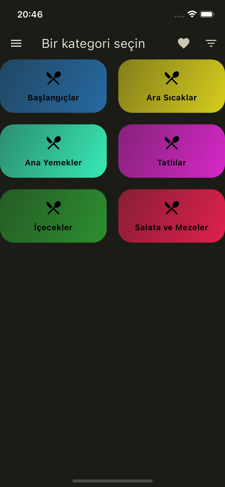
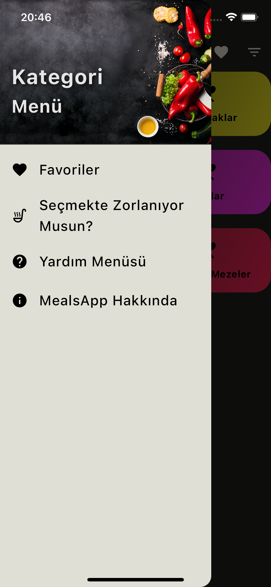
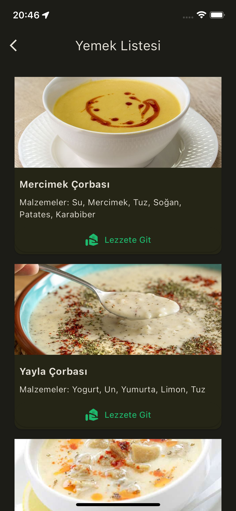
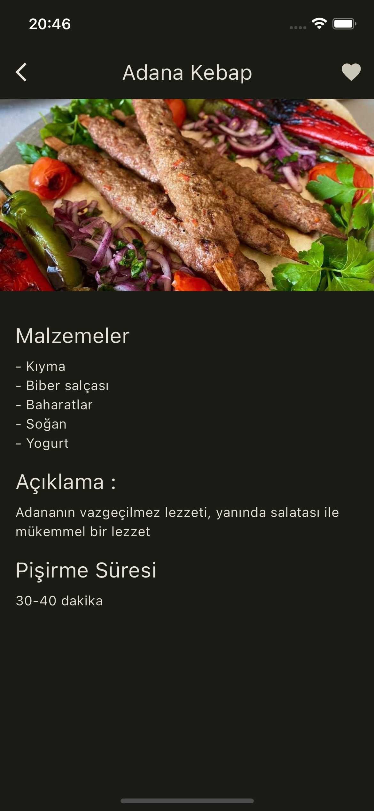
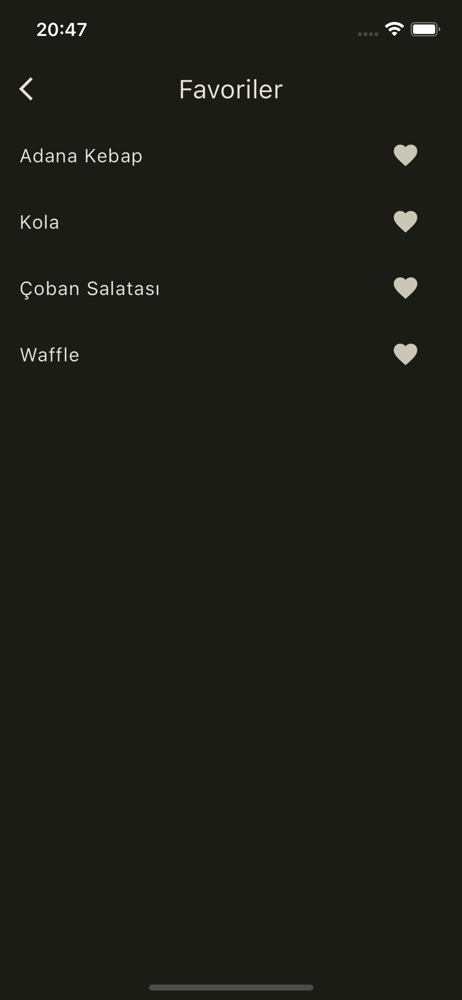

# MealsApp

"MealsApp" adlı mobil uygulama, Flutter Provider yönetimi kullanılarak geliştirilmiş bir yemek tarifleri platformudur. Kullanıcıların en sevdikleri tarifleri keşfetmelerini, kaydetmelerini ve paylaşmalarını sağlar. Kolay kullanımı ve zengin içeriğiyle yemek tutkunlarının favorisi olmayı hedefler.

## Özellikler
Ana Sayfa: Yemek kategorilerinin çeşitli başlıklar altında listelendiği ve kullanıcıların hızlıca istedikleri tarifleri bulabilecekleri bölüm.
Drawer (Kayar Menü): Kullanıcıların favori tarif listesini görüntüleyebilecekleri, profil geçişlerini yapabilecekleri, öneri sayfasını keşfedebilecekleri, yardım ve uygulama hakkında içeriklere erişebilecekleri bölüm. Ayrıca, kullanıcıların tercihlerine göre kişiselleştirilmiş öneriler de bu menüde bulunur.

## Kullanılan Teknolojiler
Flutter: UI geliştirmek için kullanılan çerçeve.
Provider: State yönetimi için kullanılan paket.

## Ekran Görüntüleri

    
     
     
     
     
    

